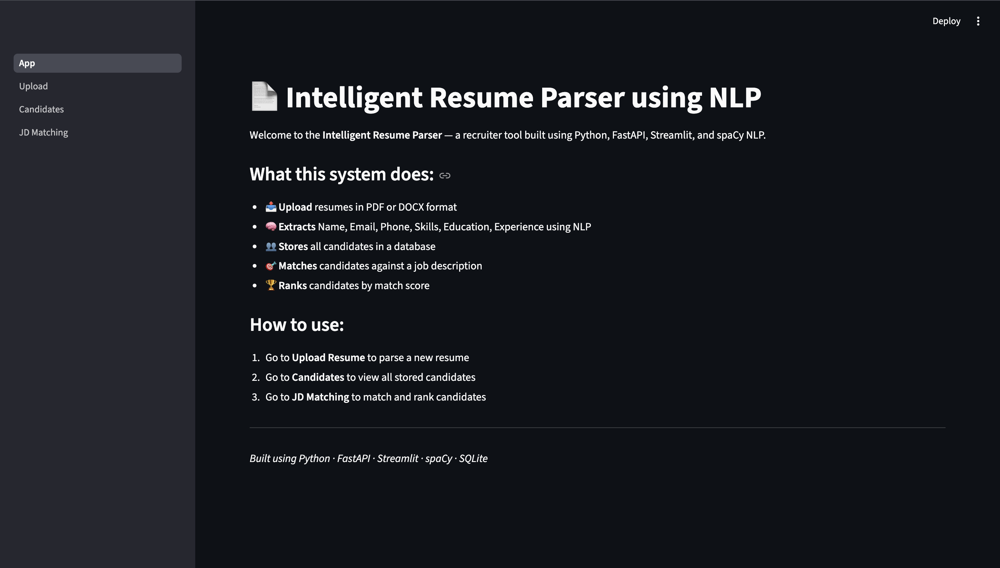
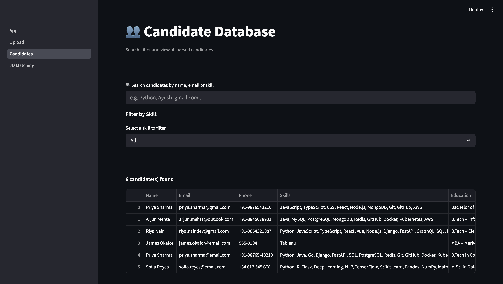
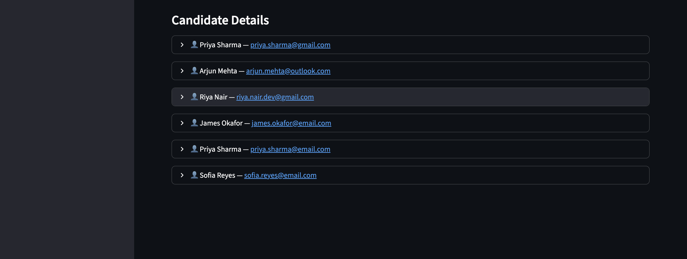
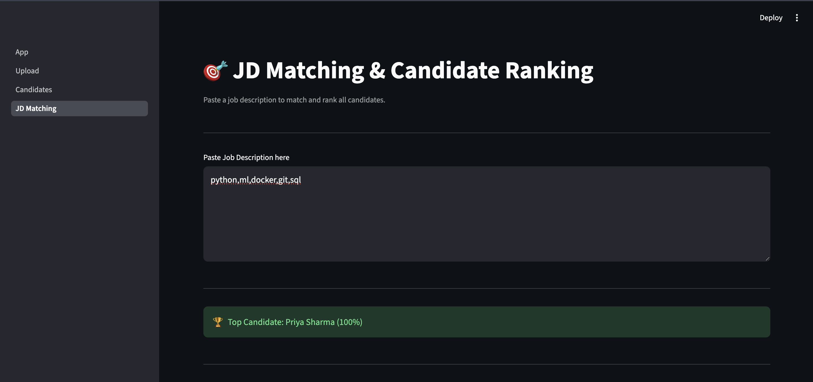
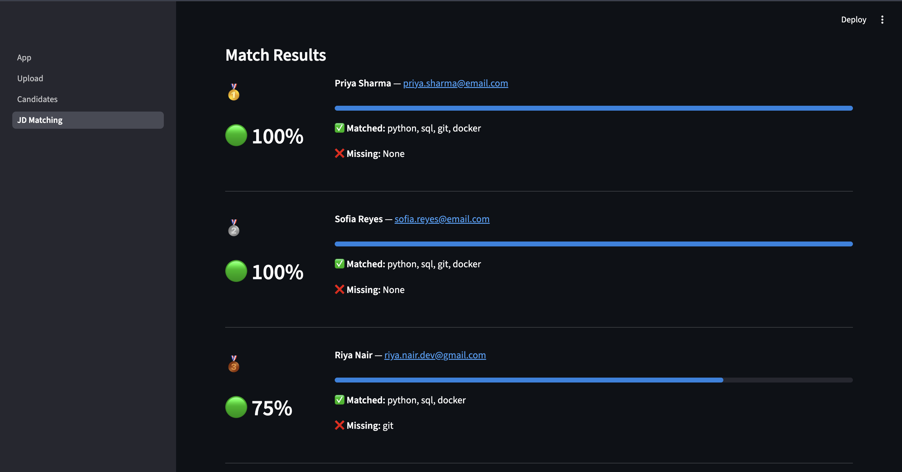
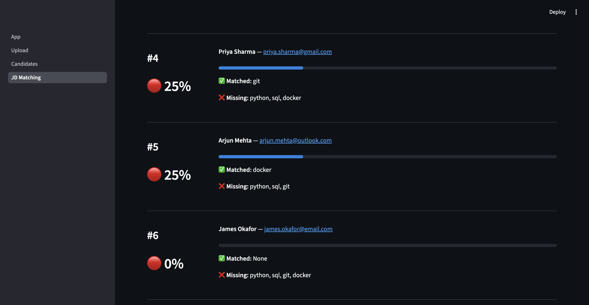
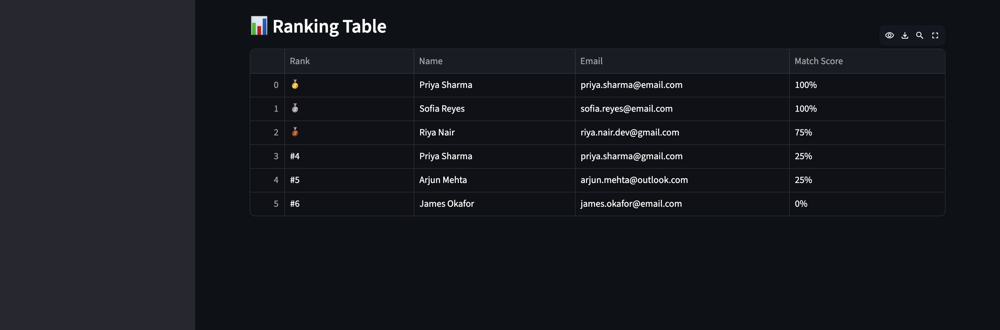

# 📄 Intelligent Resume Parser using NLP

> An AI-powered recruitment tool that automatically parses resumes, extracts candidate information using NLP, and ranks candidates against job descriptions.

## 🧠 What This Project Does

Companies receive hundreds of resumes for a single job opening. Going through each one manually is slow, inconsistent, and hard to scale. This system solves that problem by:

- Automatically reading resumes in PDF and DOCX formats
- Extracting all key candidate information using NLP
- Storing candidates in a searchable database
- Matching and ranking candidates against any job description

## ✨ Features

| Feature | Description |
|---|---|
| 📤 Resume Upload | Upload PDF or DOCX resumes |
| 🧠 NLP Extraction | Extract Name, Email, Phone, Skills, Education, Experience |
| 💾 Database Storage | All candidates saved in SQLite with duplicate prevention |
| 🔍 Search & Filter | Search by name, email, or skill — filter by specific skill |
| 🎯 JD Matching | Compare candidate skills against any job description |
| 🏆 Candidate Ranking | Rank all candidates by match score with medals |
| 🌐 REST API | Full FastAPI backend with auto-generated documentation |
| 📱 Multi-Page UI | Clean Streamlit frontend with page-based navigation |

## 🛠️ Tech Stack

Frontend   →  Streamlit (Multi-page)
Backend    →  FastAPI + Uvicorn
NLP        →  spaCy + Regex
Database   →  SQLite
Language   →  Python

## 📁 Project Structure

resume-parser-project/
│
├── App.py                       ← Home page (entry point)
│
├── pages/
│   ├── 1_Upload.py              ← Upload & parse resumes
│   ├── 2_Candidates.py          ← Search & view all candidates
│   └── 3_JD_Matching.py         ← Match & rank candidates
│
├── backend/
│   ├── main.py                  ← FastAPI REST API endpoints
│   ├── parser.py                ← PDF/DOCX text extraction
│   ├── extractor.py             ← NLP extraction functions
│   └── database.py              ← SQLite database operations
│
├── database/
│   └── resumes.db               ← SQLite database file
│
├── resumes/                     ← Uploaded resume files
├── Screenshots/                 ← Project screenshots
└── requirements.txt

## ▶️ Running the Project
This project has two components that run simultaneously. Open two separate terminals:

Terminal 1 — FastAPI Backend:
uvicorn backend.main:app --reload --port 8000

Terminal 2 — Streamlit Frontend:
streamlit run App.py

Then open in your browser:
Service	      URL
Streamlit App	http://localhost:8501
FastAPI Docs	http://localhost:8000/docs

## 🔌 API Endpoints

| Method | Endpoint | Description |
|---|---|---|
| `GET` | `/` | Health check — confirms API is running |
| `POST` | `/upload` | Upload resume file, parse and extract all info |
| `GET` | `/candidates` | Fetch all candidates from database |
| `GET` | `/candidates?search=python` | Search candidates by name, email or skill |
| `GET` | `/candidate/{id}` | Fetch one specific candidate by ID |
| `POST` | `/match` | Match all candidates against a job description |

## 📸 Screenshots

### 🏠 Home Page

### 👥 Candidate Database

### 🎯 JD Matching

### 🏆 Candidate Rankings

## 🔍 How It Works

User uploads resume (PDF/DOCX)
          ↓
FastAPI receives file via /upload endpoint
          ↓
parser.py extracts raw text from file
          ↓
extractor.py runs NLP on raw text:
  → Name       — spaCy NLP + rule-based detection
  → Email      — Regex pattern matching
  → Phone      — Regex pattern matching
  → Skills     — Keyword matching (whole word regex)
  → Education  — Section-based NLP parsing
  → Experience — Section-based NLP parsing
          ↓
database.py saves candidate to SQLite
          ↓
Streamlit displays extracted information
          ↓
Recruiter pastes Job Description
          ↓
/match endpoint compares candidate skills vs JD skills
          ↓
Candidates ranked by match score (highest first)

## 📦 Dependencies

streamlit
fastapi
uvicorn
python-multipart
pdfplumber
python-docx
spacy
requests
pandas

## 🌿 Git Branches

| Branch | Description |
|---|---|
| `main` | Stable production branch |
| `fastapi-backend` | FastAPI + multi-page routing (merged into main) |

## 🚀 Future Scope

- [ ] Deploy on Streamlit Cloud
- [ ] Resume Score Card — score resumes out of 100
- [ ] Skills Gap Analysis — visual gap between candidate and JD
- [ ] Resume vs Resume comparison
- [ ] Email notifications for top candidates

## 👨‍💻 Author

**Ayush Sawhney**
B.Tech Computer Science Engineering
Amity University, Noida

[![GitHub] (https://github.com/Ayush06-coder)]

## 📌 Project Status

> 🟢 **Active Development** — Internship Project at Team Computers

*Built with Python · FastAPI · Streamlit · spaCy · SQLite*