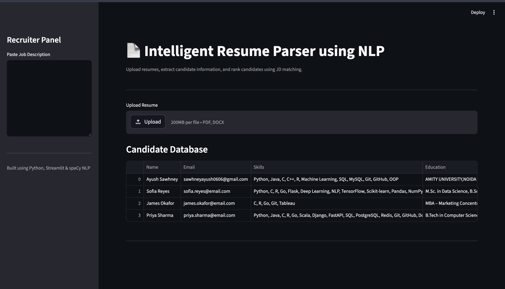
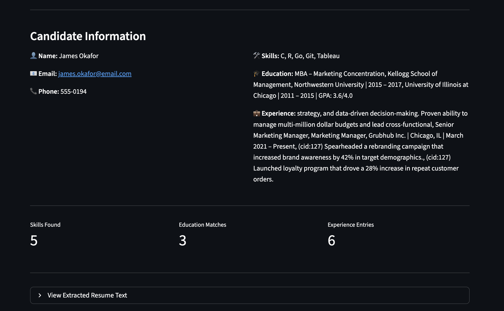
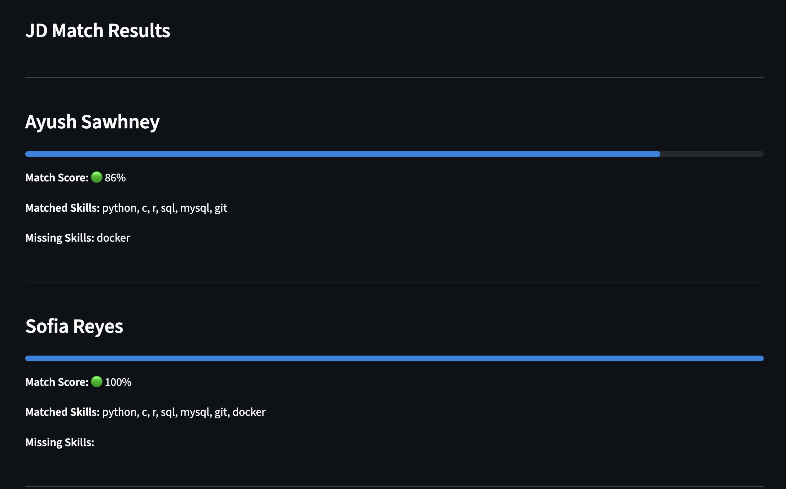
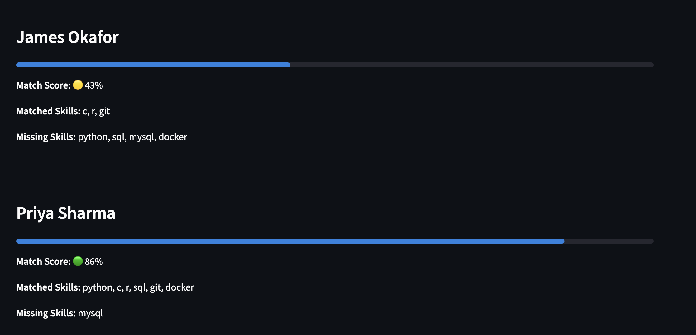
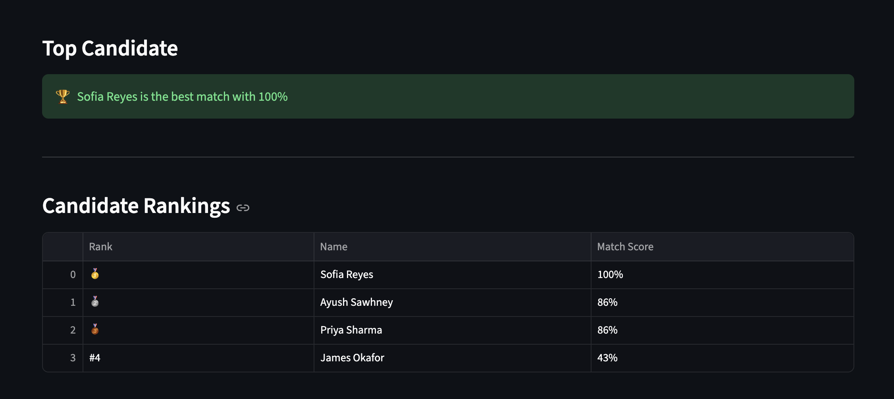

# Intelligent Resume Parser using NLP

An Intelligent Resume Parsing System built using Python, Streamlit, and spaCy NLP to extract structured candidate information from resumes in PDF and DOCX format.

---

## Features

✅ Resume Upload (PDF/DOCX)  
✅ Resume Text Extraction  
✅ Name Extraction using spaCy NLP  
✅ Email & Phone Number Extraction  
✅ Skills Extraction  
✅ Education Extraction  
✅ Experience Extraction  
✅ Job Description Matching  
✅ Candidate Ranking System  

---

## Tech Stack

- Python
- Streamlit
- spaCy NLP
- SQLite
- Regex
- pdfplumber
- python-docx

---

## Project Workflow

```text
Resume Upload
      ↓
PDF/DOCX Parsing
      ↓
Text Extraction
      ↓
NLP Processing
      ↓
Information Extraction
      ↓
JD Matching
      ↓
Candidate Ranking
```

---

## Installation

```bash
pip install -r requirements.txt
streamlit run app.py
```

---

## Learning Outcomes

- NLP using spaCy
- Resume Parsing
- Regex-based Extraction
- Streamlit Frontend Development
- SQLite Database Integration
- Git & GitHub Workflow

## Future Scope

- Recruiter Dashboard
- Search & Filter System
- Better UI/UX
- Deployment
- OCR Support

## Screenshots

### Home Page


### Candidate Information


### JD Matching




### Candidate Rankings


---

## Author

Ayush Sawhney  
B.Tech Computer Science Engineering Student
