# 📄 RecruitAI — Intelligent Resume Parser & Hiring Platform

> An AI-powered recruitment platform with role-based access. Candidates apply to jobs without login. Recruiters log in to manage applications, rank candidates, and post jobs with auto-generated JDs.

---

## 🧠 What This Project Does

Companies receive hundreds of resumes for each job posting. Manual screening is slow and biased. This platform solves that by:

- **Public Job Board** — Candidates view open jobs and apply without any login
- **AI Resume Parsing** — Automatically extracts name, email, phone, skills, education, experience, and certifications from PDF/DOCX
- **Smart Matching** — Calculates match scores (skills 60% + experience 25% + certifications 15%) against job requirements
- **Candidate Ranking** — Ranks applicants with medals and progress bars
- **Auto JD Generation** — Admin generates professional job descriptions with one click
- **Application Tracking** — Candidates get a personalised tracking link after applying to check status anytime
- **Role-Based Access** — Three user types: Candidate (public), Recruiter (user), Admin

---

## ✨ Features

| Feature | Description |
|---|---|
| 📤 Public Apply | Candidates apply to jobs without login |
| 🧠 NLP Extraction | spaCy-powered extraction of all candidate details |
| 🎯 AI Match Scoring | Skills (60%) + Experience (25%) + Certifications (15%) breakdown |
| 🏆 Ranked Applications | Top 3 get medals, progress bars for all |
| 💼 Job Posting | Admin posts jobs with auto-generated descriptions |
| ✨ Auto JD Generation | One-click professional job description generation |
| 🔗 Application Tracking Link | Personalised URL shown after apply — candidates bookmark it to track status |
| 🔐 Authentication | Admin vs User roles, bcrypt hashing, account lockout after 5 failed attempts |
| 📊 Analytics Dashboard | Charts for skills, education, experience distribution across all candidates |
| 👥 Candidate Database | Search, filter, paginate, and admin-only delete |
| 🔍 Track Application | Candidates track status via email or direct tracking link |

---

## 🛠️ Tech Stack

| Layer | Technology |
|---|---|
| Frontend | Streamlit (Multi-page + `st.navigation`) |
| Backend | FastAPI + Uvicorn |
| NLP | spaCy (`en_core_web_lg`) + Regex |
| Database | SQLite |
| Auth | Bcrypt password hashing |
| Styling | Custom CSS (Dark cyan/teal theme) |
| Containerisation | Docker |
| Language | Python 3.11 |

---

## 📁 Project Structure

```
resume-parser-project/
├── App.py                      ← Navigation controller (role-based page routing)
├── auth.py                     ← Login/logout, roles, password management, lockout
├── styles.py                   ← Shared dark CSS (cyan/teal theme, #030c10 background)
├── config.py                   ← API_URL from environment variable
├── requirements.txt            ← All pinned dependencies
├── Dockerfile                  ← Docker container (Python 3.11-slim, runs both services)
├── start.sh                    ← Starts FastAPI (background) + Streamlit (foreground)
├── Procfile                    ← For platforms that use process-based deployment
│
├── backend/
│   ├── main.py                 ← FastAPI endpoints (upload, match, jobs, applications, generate-jd)
│   ├── parser.py               ← PDF/DOCX text extraction (pdfplumber + python-docx)
│   ├── extractor.py            ← NLP: name, email, phone, skills, education, experience, certifications
│   └── database.py             ← SQLite: candidates, jobs, applications, users tables
│
├── database/
│   └── resumes.db              ← SQLite database (created on first run, gitignored)
│
├── pages/
│   ├── Home.py                 ← Public landing page with job listings
│   ├── Apply.py                ← Candidate application form + tracking link after submit
│   ├── Track.py                ← Track application by email or URL param (no login)
│   ├── Login.py                ← Company login page
│   ├── Dashboard.py            ← Company overview: jobs, candidates, total applications
│   ├── Applications.py         ← View applications per job, ranked by match score
│   ├── JD_Matching.py          ← Match all candidates against a pasted JD in real-time
│   ├── Analytics.py            ← Charts: top skills, education breakdown, experience roles
│   ├── Admin.py                ← Admin only: users, jobs, applications management
│   ├── Candidates.py           ← View all candidates (search, filter, paginate, admin delete)
│   └── Change_Password.py      ← Password change (required first login + optional anytime)
│
└── resumes/                    ← Uploaded resume files (gitignored except sample)
```

---

## 🔄 Workflow

### Candidate Flow (No Login)
1. Visits public landing page → sees open jobs with required skills
2. Clicks "Apply" on a job → fills name, email, phone + uploads resume (PDF/DOCX)
3. Gets instant match score with skills, experience, and certifications breakdown
4. Gets a personalised tracking link — bookmarks it to check status anytime
5. Can also go to Track page and enter their email to see all applications

### Company Flow (Login Required)
1. Admin/User logs in → forced to change password on first login
2. Dashboard shows metrics: Total Jobs, Open Positions, Candidates, Total Applications
3. Applications page → select job → see ranked applicants (🥇🥈🥉)
4. Can shortlist, schedule interview, or reject candidates
5. JD Matching → paste any JD → all candidates ranked in real-time
6. Analytics → visual breakdown of all candidates (skills, education, experience)
7. Admin can post jobs (with Auto Generate JD), manage users, delete candidates

---

## ▶️ Running Locally

### Prerequisites
```bash
pip install -r requirements.txt
```
> spaCy model is installed automatically via `requirements.txt` (wheel URL included)

Create a `.env` file in the project root:
```env
API_URL=http://localhost:8000
```

### Start the app
Open two separate terminals from the project root.

**Terminal 1 — FastAPI Backend:**
```bash
uvicorn backend.main:app --reload --port 8000
```

**Terminal 2 — Streamlit Frontend:**
```bash
streamlit run App.py
```

| Service | URL |
|---|---|
| Streamlit App | http://localhost:8501 |
| FastAPI Docs | http://localhost:8000/docs |

---

## 🐳 Running with Docker

```bash
# Build the image
docker build -t recruitai .

# Run the container
docker run -p 8000:8000 -p 8501:8501 \
  -e API_URL=http://localhost:8000 \
  -e FRONTEND_URL=http://localhost:8501 \
  recruitai
```

Then open http://localhost:8501

---

## 🌐 Deploying on Render

See the full step-by-step deploy guide in the [Deploy Guide](#) section below or follow these steps:

1. Push your code to GitHub
2. Go to [render.com](https://render.com) → New → Web Service
3. Connect your GitHub repo
4. Set **Environment** to `Docker`
5. Set these environment variables in Render:
   ```
   API_URL=https://your-app-name.onrender.com
   FRONTEND_URL=https://your-app-name.onrender.com
   ADMIN_DEFAULT_PASSWORD=YourSecurePassword
   ```
6. Deploy — Render builds the Docker image and starts your app

---

## 🔌 API Endpoints

| Method | Endpoint | Description |
|---|---|---|
| `GET` | `/` | Health check |
| `POST` | `/upload` | Upload resume, parse and save to candidates |
| `GET` | `/candidates` | Fetch candidates (supports `?search=`, `?page=`, `?page_size=`) |
| `GET` | `/candidate/{id}` | Fetch a single candidate by ID |
| `DELETE` | `/candidates/{id}` | Delete candidate (admin) |
| `POST` | `/match` | Match all candidates against a JD |
| `POST` | `/generate-jd` | Auto-generate a professional job description |
| `POST` | `/jobs` | Post new job |
| `GET` | `/jobs` | List all jobs |
| `GET` | `/jobs/{id}` | Get a single job by ID |
| `PUT` | `/jobs/{id}` | Update job status (open/closed) |
| `DELETE` | `/jobs/{id}` | Delete job + all its applications |
| `POST` | `/jobs/{id}/apply` | Apply to job with resume upload |
| `GET` | `/jobs/{id}/applications` | Get all applications for a job |
| `PUT` | `/applications/{id}` | Update application status |
| `GET` | `/track/{email}` | Track all applications by candidate email |

---

## 🔐 Default Credentials

| Role | Username | Password | Notes |
|---|---|---|---|
| Admin | `admin` | `RecruitAI@2026` | Must change on first login. Set via `ADMIN_DEFAULT_PASSWORD` env var |
| User | Created by admin | `ChangeMe@123` | Must change on first login |

> **Security:** Accounts are locked for 15 minutes after 5 failed login attempts.

---

## 🎨 UI Theme

- Dark background: `#030c10`
- Sidebar: `#050f15`
- Primary accent: Cyan/Teal (`#22d3ee`, `#0891b2`)
- Cards: Dark surface `#061a20` with subtle borders
- Progress bars: Gradient cyan
- Status badges: Color-coded (green = shortlisted, yellow = interview, red = rejected, purple = applied)

---

## 📸 Screenshots

| Page | Screenshot |
|------|------------|
| Public Home / Job Board | 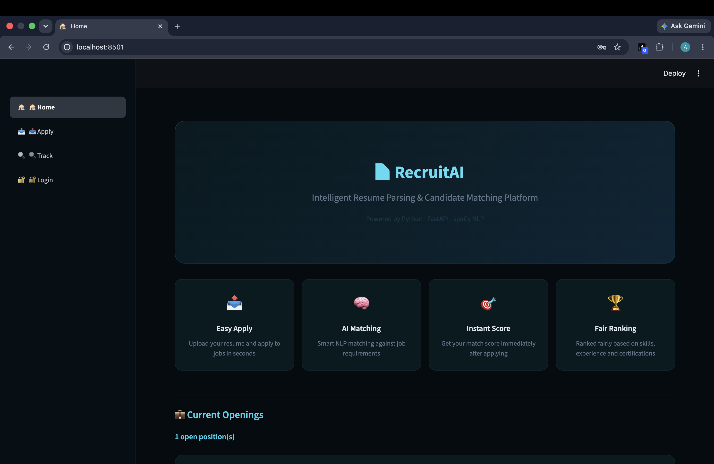 <br> 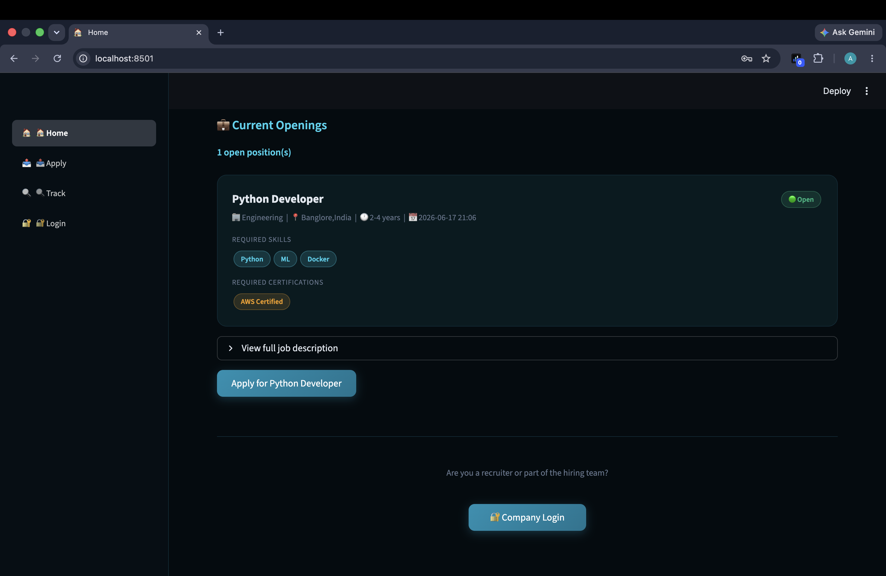 |
| Apply Form | 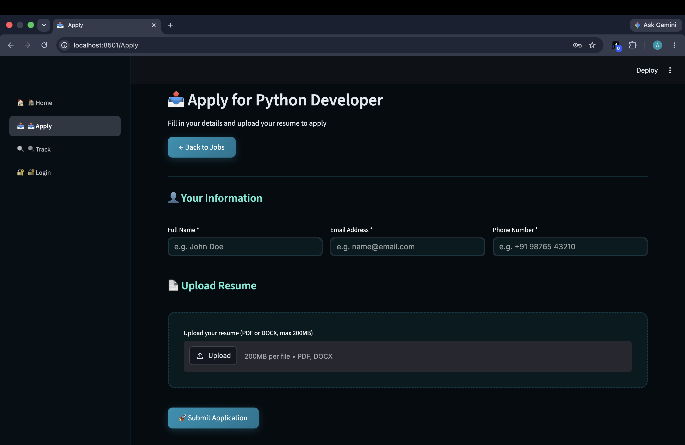 |
| Track Application | 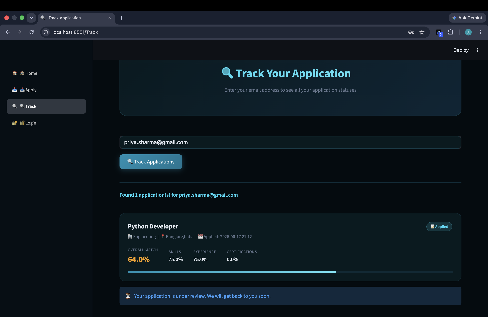 |
| Login | 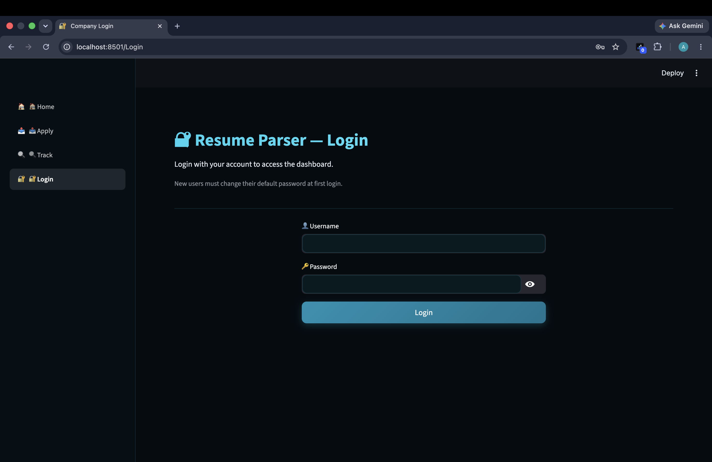 |
| Dashboard | 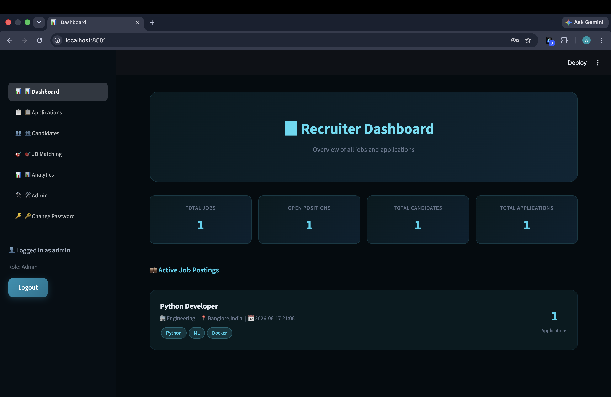 |
| Applications (Ranked) | 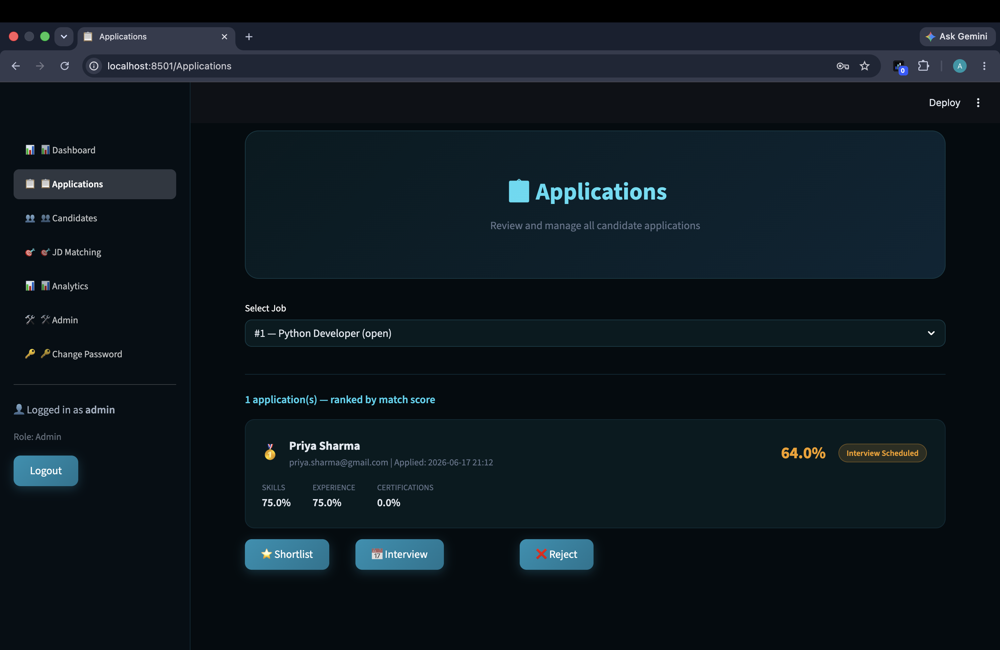 |
| JD Matching | 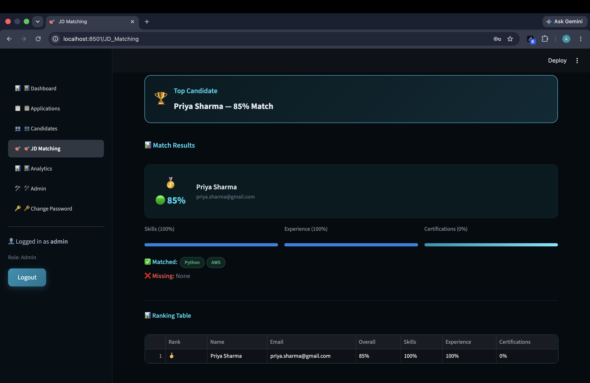 |
| Analytics | 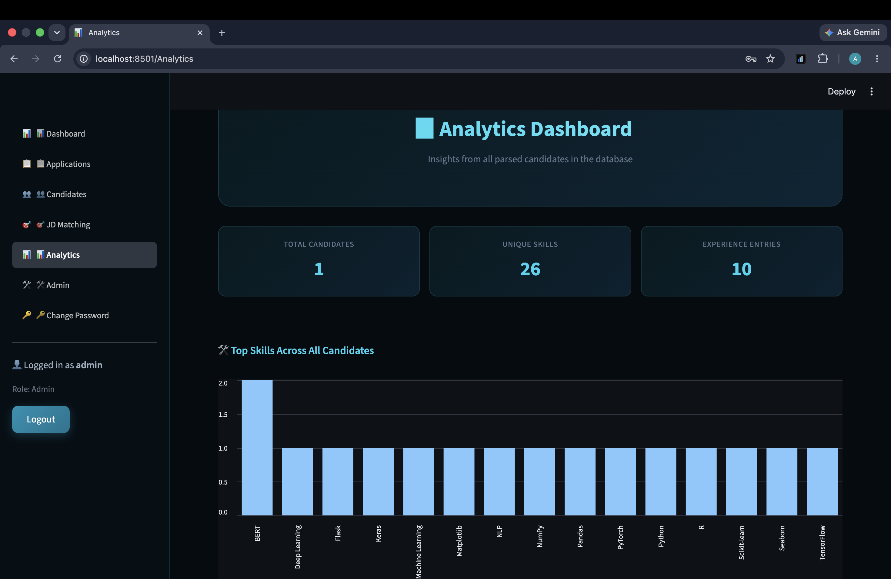 <br> 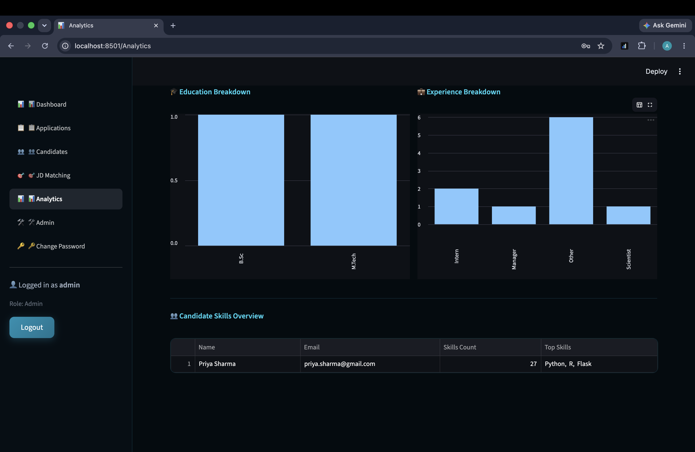 |
| Admin Panel | 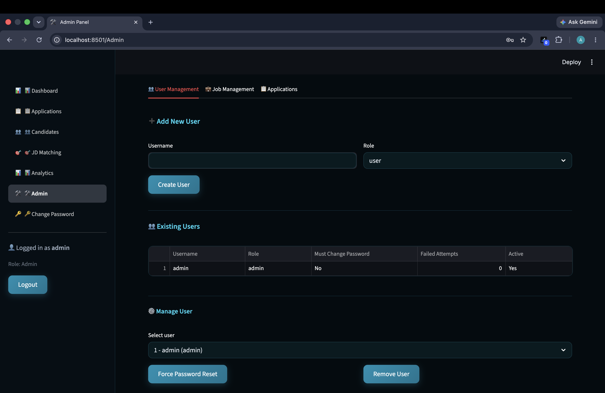 <br> 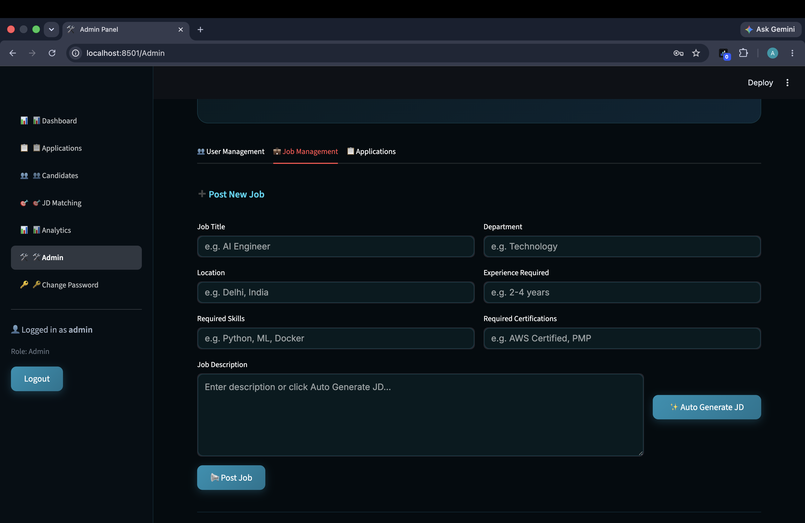 <br> 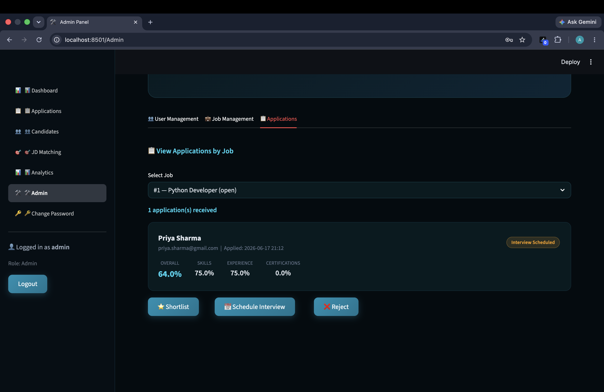 |
| Candidates Database | 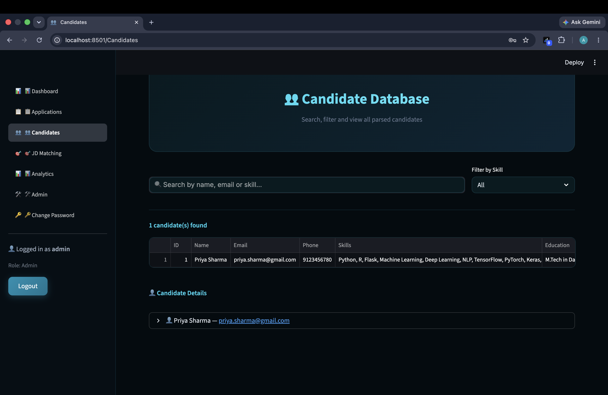 |

---

## 📦 Key Dependencies

See `requirements.txt` for the full pinned list. Key packages:

- `streamlit` — Frontend UI
- `fastapi` + `uvicorn` — Backend API
- `spacy` + `en_core_web_lg` — NLP processing
- `bcrypt` — Password hashing
- `pdfplumber` — PDF text extraction
- `python-docx` — DOCX text extraction
- `pandas` — Data tables and analytics
- `requests` — Frontend → backend HTTP calls
- `python-dotenv` — Environment variable loading

---

## 🌿 Git Branches

| Branch | Description |
|---|---|
| `main` | Current stable version with full workflow |
| `navigation-redesign` | Merged — role-based sidebar with `st.navigation` |
| `workflow-redesign` | Merged — public apply flow + company dashboard |
| `job-posting` | Merged — job posting & auto JD generation |
| `ui-redesign` | Merged — dark cyan/teal UI theme |
| `enhanced-matching` | Merged — skills + experience + certifications match scoring |
| `auth-system` | Merged — login, roles, and password management |
| `fastapi-backend` | Merged — FastAPI backend and endpoints |

---

## 👨‍💻 Author

**Ayush Sawhney**
B.Tech Computer Science Engineering — Amity University, Noida
GitHub: [@Ayush06-coder](https://github.com/Ayush06-coder)

---

## 📌 Project Status

🟢 Active Development — Internship Project

Built with Python · FastAPI · Streamlit · spaCy · SQLite · Bcrypt · Docker